# Acceleration_via_intel_optimization_for_pytorch
This repo helps in practicing the concepts like Sklearn, regression, Tensorflow, PyTorch. 

Additionally, accelerate the regression or classification data mining pipeline.

## DataSet Chosen 
I have used multiple datasets in this assignment.

For obtaining familiarity with Sklearn, I chose breast cancer Wisconsin dataset.

I have used “Fashion MNIST” dataset for training neural networks using PyTorch.

For the acceleration, the option I chose is Accelerate Tensorflow or PyTorch regression or classification. 

From this, I chose: Accelerate the algorithm via Intel Optimization for Pytorch (https://www.intel.com/content/www/us/en/developer/articles/guide/getting-started-with-intel-optimization-of-pytorch.html)

## Steps Carried out
### Section 1 : Sklearn
I gained practice on sklearn datasets and the basic commands that can be used to access the data, shape the data and displaying the required graphs, heat map and many more.
The breast cancer dataset has been used for performing various types of regression and in multiple methods like one variable and multiple variables.

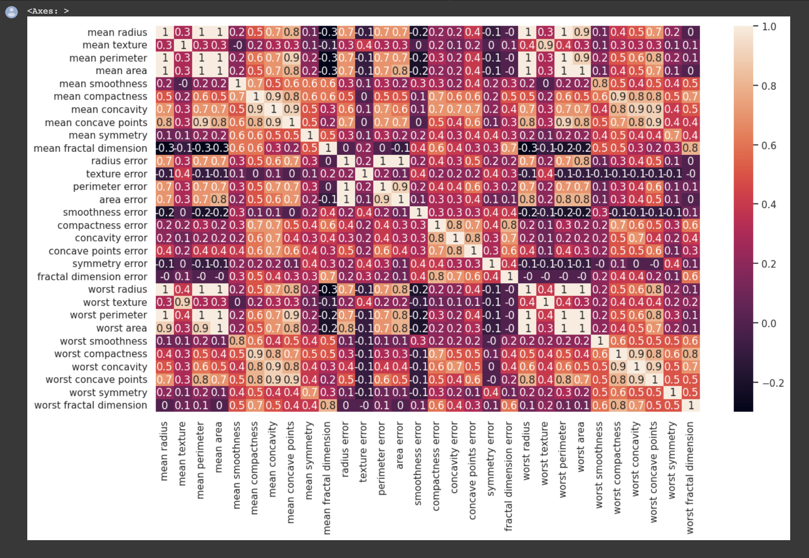

Actual vs prediction graph in the regression for all variables

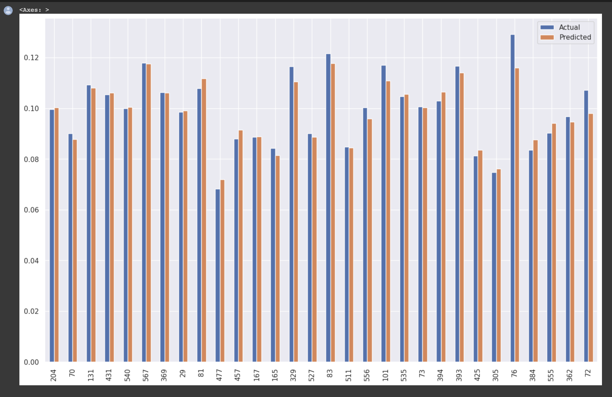

### Section 2 : PyTorch Logistic Regression
With the same breast cancer Wisconsin dataset, created a model and obtained metrics by defining the logistic

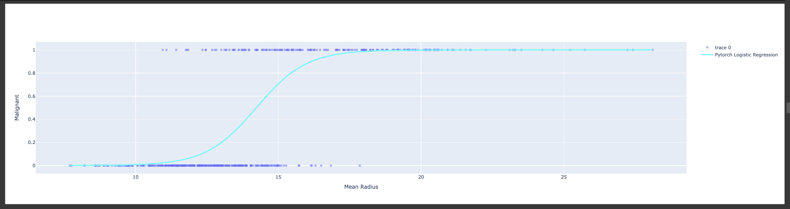

### Section 3 : Training Neural networks with PyTorch
Dataset chosen is Fashion MNIST.

Got an exposure on creating a model and training it.

Attaching snippets below to show how the model is before trained and after training, the output that is obtained.

#### Before Training:

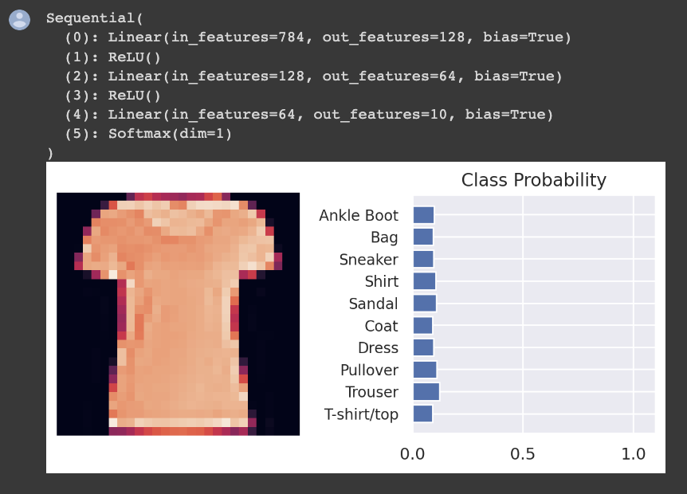

#### After Training:

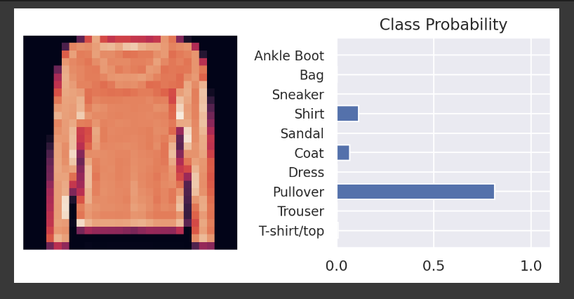

By utilizing the same Fashion MNIST dataset and considering 30 epochs, plotted two graphs.

#### Training losses vs Validation losses

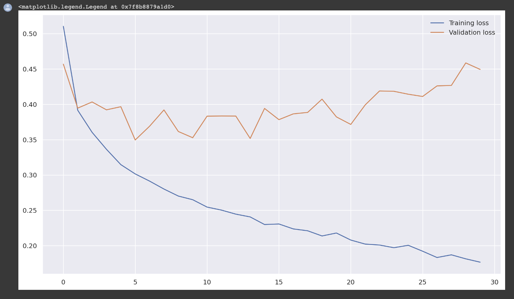

#### Train Accuracy vs Test Accuracy

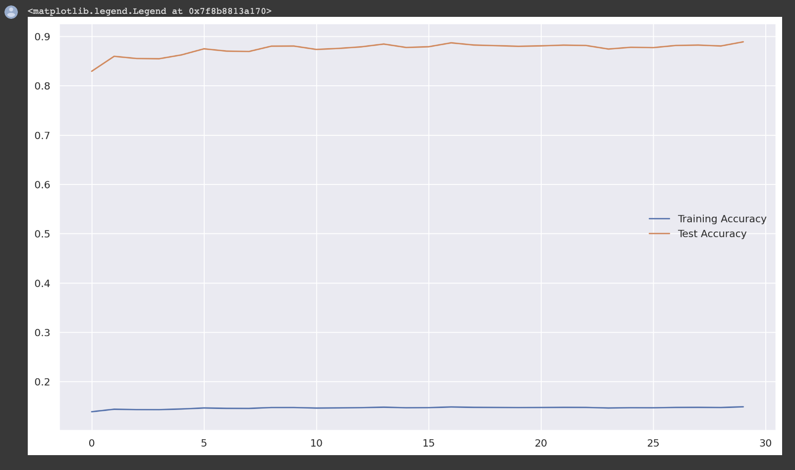

## Section4 : Intel Optimization for PyTorch

Before Acceleration:

From the torchvision models, I have used “resnet50” model and measured the execution time before training the model.

#### Intel Optimization Extension for PyTorch
First, we will have to install this extension with the command below: 

!pip install 

#### intel_extension_for_pytorch 

Here, train the model, by giving pretrained = True and this is also done on the same “resnet50” model.

For optimizing with Intel Extension, there are only few lines of code changes to be done. 

1. Torch.channels_last : This has to be applied to both model object and data in order to increase the CPU resource usage efficiency.

2. ipex.optimize : This function is used for optimization. Inference: Channels last is a memory layout format that is more friendly to Intel Architecture. 

We recommend using this memory layout format for computer vision workloads by invoking to(memory_format = torch.channels_last) function against the model object and input data. 

The optimize function of Intel Extension for PyTorch applies optimizations to the model, bringing additional performance boosts. For both computer vision workloads and NLP workloads, we recommend applying the optimize function against the model object.

After performing these changes, I measured the execution time again. 

Before Acceleration, the execution time was 217.30 ms.

After Acceleration, with inference, the execution time is 36.8 ms, this is the Imperative mode. 

There is an other mode, which is TorchScript mode, this is generally used for obtaining further optimizations In this mode, the execution time obtained is 9.52 ms. A graph is attached below.

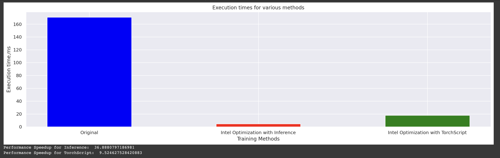

I have learnt how to use tensorboard and upload data to it. 

For this, I have chosen “Fashion MNIST” dataset, created a simple model, trained it and pushed the logs to the tensorboard. 

All the steps are defined in the colab link under Tensorboard section. 

TensorBoard logs are created during training by passing the TensorBoard and hyperparameters callbacks to Keras' Model.fit(). 

These logs can then be uploaded to TensorBoard.dev. Uploading the TensorBoard logs will give you a URL that can be shared with anyone. Attaching the snippets of the TensorBoard.

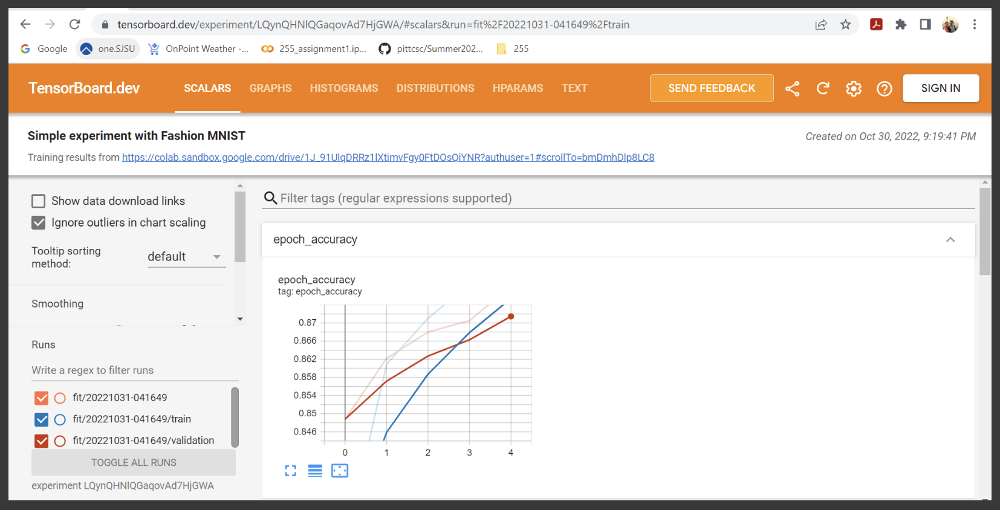

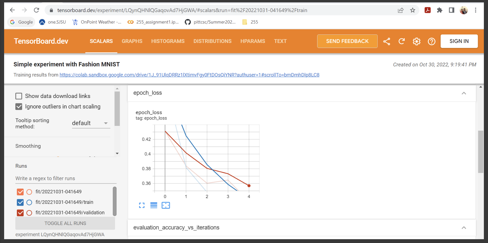

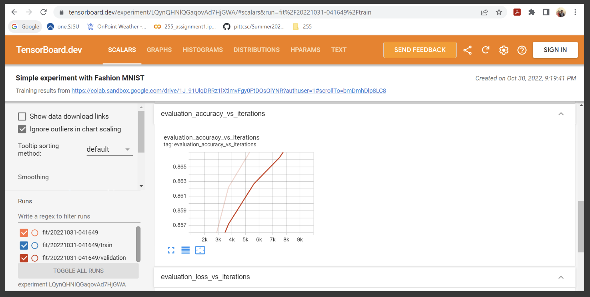

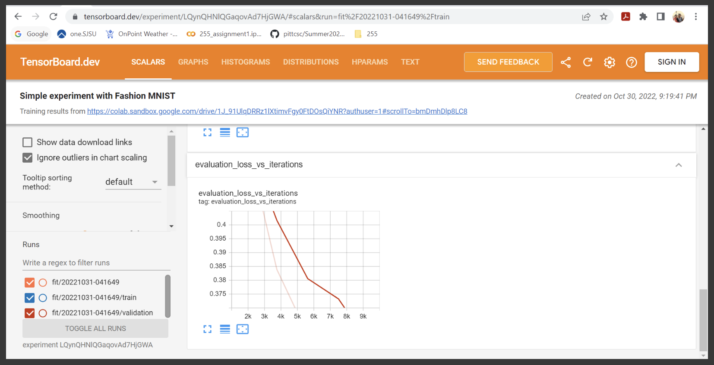

References:
1. https://intel.github.io/intel-extension-for-pytorch/cpu/latest/tutorials/examples.html
2. https://tensorboard.dev/
3. https://intel.github.io/intel-extension-for-pytorch/cpu/latest/tutorials/installation.html
4. https://intel.github.io/intel-extension-for-pytorch/cpu/latest/tutorials/features/nhwc.html

